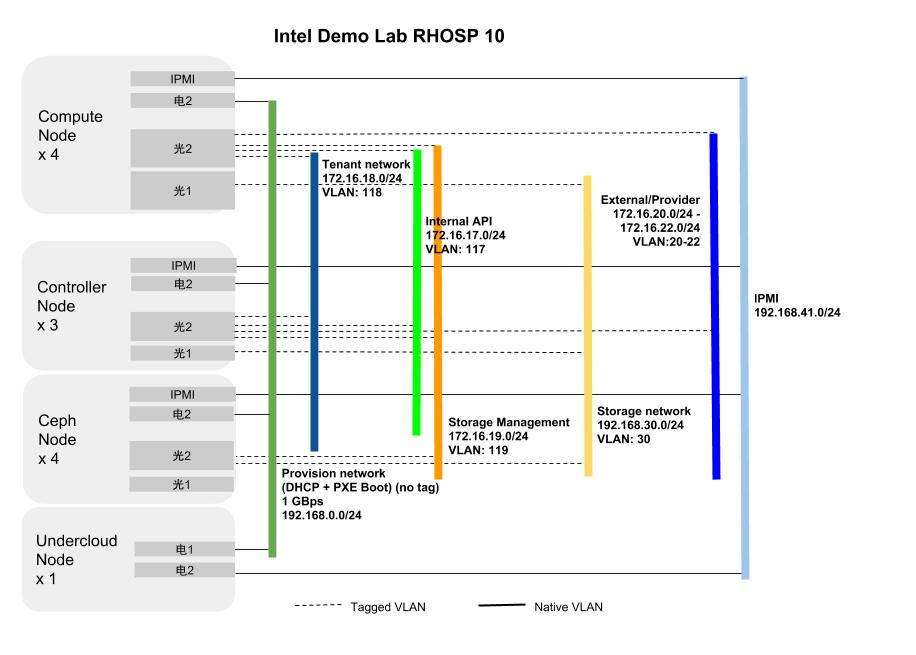

# Intel Demo Lab 网络设计

## 使用Vlan进行网络隔离
网络|IP地址及掩码|VLAN|内部 使用|备注
:---|:----------:|:------:|:--:|:--:
网络1 - Provisioning|172.16.0.0/24|N/A|是|DHCP  PXE
网络2 - Internal API|172.16.17.0/24|117|是|
网络3 - Tenant|172.16.18.0/24|118|是|
网络4 - Storage|192.168.30.0/24|30|是|
网络5 - Storage Management|172.16.19.0/24|119|是|
网络6 - External|172.16.20.0/24|120|否|物理网络，可访问Internet
网络7 - IPMI|172.16.20.0/24|N/A|否|Undercloud-to-IPMI可访问此地址段
网络8 - Provider|172.16.21.0/24 - 172.16.22.0/24|N/A|否|物理网络，供应用使用

## 服务器后视图
TODO

## 网络接口映射
节点角色|网络|网络接口|绑定模式|备注
:------:|:--:|:------:|:------:|:--:
undercloud|网络1-Provisioning|电口1|N/A|
undercloud|Undercloud-to-IPMI|电口2|N/A|
controller|IPMI|IPMI|N/A|
controller|网络1-Provisioning|电口1|N/A|
controller|网络6-External|电口2|N/A|
controller|网络2-Internal API 网络3-Tenant 网络5-Storage Mgmt 网络6-External 网络8-Provider|光口2|N/A|
controller|网络4-Storage|光口1|N/A|
compute|IPMI|IPMI|N/A|
compute|网络1-Provisioning|电口1|N/A|
compute|网络2-Internal API 网络3-Tenant 网络8-Provider|光口2|N/A|
compute|网络4-Storage|光口1|N/A|

## 拓扑结构
**Intel Demo Lab VLAN 拓扑结构**

