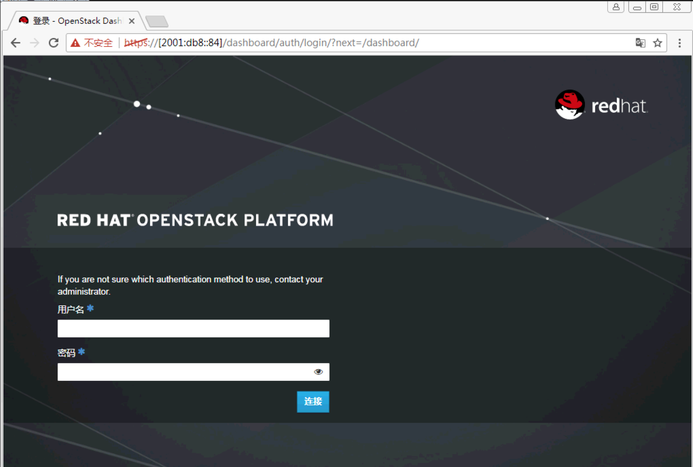

# IPv6测试用例确认情况

## Case支持情况

|Case No.|Case描述|是否支持|备注|
|:-------|:-------|:------:|:--:|
|6.1.3|支持NTP服务|OK|计算节点手工配置ntp指向controller internalapi IPv6地址|
|6.1.4.1|所有portal登录均支持IPv6方式|POK|OSP支持，其他待诺基亚验证|
|6.1.4.2|支持告警通过IPv6上报|POK|OSP支持IPv6对接gnocchi，其他待诺基亚验证|
|6.1.4.6|VIM北向接口的访问入口|POK|identity admin为IPv4，其他为IPv6|


### 6.1.3

overcloud 节点

```
[stack@undercloud (stackrc) ~]$ nova list
+--------------------------------------+------------------------+--------+------------+-------------+------------------------+
| ID                                   | Name                   | Status | Task State | Power State | Networks               |
+--------------------------------------+------------------------+--------+------------+-------------+------------------------+
| 84b04784-01f9-4faa-b5b3-3ad5edee813b | overcloud-Controller-0 | ACTIVE | -          | Running     | ctlplane=172.31.255.3  |
| 1c1ab646-4903-46d6-bc86-72a29853237f | overcloud-OvsCompute-0 | ACTIVE | -          | Running     | ctlplane=172.31.255.11 |
+--------------------------------------+------------------------+--------+------------+-------------+------------------------+
```

在 controller 上查看 ntp.conf 配置和运行状态
```
[stack@undercloud (stackrc) ~]$ ssh heat-admin@172.31.255.3 'sudo cat /etc/ntp.conf | grep db8 '
server 2001:db8::82
[stack@undercloud (stackrc) ~]$ ssh heat-admin@172.31.255.3 'sudo ntpq -p -n '
     remote           refid      st t when poll reach   delay   offset  jitter
==============================================================================
*2001:db8::82    LOCAL(0)         4 u  449  512  377    0.704   -6.357   3.521
```

在 compute 上查看 ntp.conf 配置和运行状态
```
[stack@undercloud (stackrc) ~]$ ssh heat-admin@172.31.255.11 'sudo cat /etc/ntp.conf | grep fd'
server fd00:fd00:fd00:1::18
[stack@undercloud (stackrc) ~]$ ssh heat-admin@172.31.255.11 'sudo ntpq -p -n '
     remote           refid      st t when poll reach   delay   offset  jitter
==============================================================================
*fd00:fd00:fd00: 186.101.102.249  5 u   22   64  377    0.134   14.306   3.891
```

**注意**
* 计算节点 ntp 服务器需手工指定到控制节点的 internal api 地址上

### 6.1.4.1

浏览器访问 overcloud horizon ipv6 地址，入口地址参见 overcloudrc


### 6.1.4.2

查看 gnocchi endpoint 信息 

```
[stack@undercloud (stackrc) ~]$ source overcloudrc
[stack@undercloud (overcloudrc) ~]$ openstack --insecure endpoint show gnocchi
+--------------+------------------------------------+
| Field        | Value                              |
+--------------+------------------------------------+
| adminurl     | http://[fd00:fd00:fd00:1::10]:8041 |
| enabled      | True                               |
| id           | ee9768118c29439cb8e5d799089df38c   |
| internalurl  | http://[fd00:fd00:fd00:1::10]:8041 |
| publicurl    | https://[2001:db8::84]:13041       |
| region       | regionOne                          |
| service_id   | 8e88b38cb0c442ea84d8bcb00a73ca12   |
| service_name | gnocchi                            |
| service_type | metric                             |
+--------------+------------------------------------+
```
**注意**
* 证书使用 ipv4 地址，访问 https url 时需添加 --insecure 参数


### 6.1.4.6

查看 overcloud identity,image,compute,network,volumev2,orchestration endpoint 信息
```
[stack@undercloud (overcloudrc) ~]$ source overcloudrc
[stack@undercloud (overcloudrc) ~]$ for i in identity image compute network volumev2 orchestration; do echo $i ; openstack --insecure endpoint show $i ; echo ; done 
dentity
+--------------+-----------------------------------------+
| Field        | Value                                   |
+--------------+-----------------------------------------+
| adminurl     | http://172.31.255.4:35357/v2.0          |
| enabled      | True                                    |
| id           | 16f1cb37d36f46c4976b6a7e1ad9c58f        |
| internalurl  | http://[fd00:fd00:fd00:1::10]:5000/v2.0 |
| publicurl    | https://[2001:db8::84]:13000/v2.0       |
| region       | regionOne                               |
| service_id   | d8fcf8c2bed64895a463235dedfa3251        |
| service_name | keystone                                |
| service_type | identity                                |
+--------------+-----------------------------------------+

image
+--------------+------------------------------------+
| Field        | Value                              |
+--------------+------------------------------------+
| adminurl     | http://[fd00:fd00:fd00:2::12]:9292 |
| enabled      | True                               |
| id           | 33fb07e162fc4fa7813bdaca5089f178   |
| internalurl  | http://[fd00:fd00:fd00:2::12]:9292 |
| publicurl    | https://[2001:db8::84]:13292       |
| region       | regionOne                          |
| service_id   | 35d8bff9001b4c7581c93a076ba97ad4   |
| service_name | glance                             |
| service_type | image                              |
+--------------+------------------------------------+

compute
+--------------+-----------------------------------------+
| Field        | Value                                   |
+--------------+-----------------------------------------+
| adminurl     | http://[fd00:fd00:fd00:1::10]:8774/v2.1 |
| enabled      | True                                    |
| id           | b340ecd813f1450ba50d89d96e058726        |
| internalurl  | http://[fd00:fd00:fd00:1::10]:8774/v2.1 |
| publicurl    | https://[2001:db8::84]:13774/v2.1       |
| region       | regionOne                               |
| service_id   | 0afb10d2fb654933be685359137d0e9a        |
| service_name | nova                                    |
| service_type | compute                                 |
+--------------+-----------------------------------------+

network
+--------------+------------------------------------+
| Field        | Value                              |
+--------------+------------------------------------+
| adminurl     | http://[fd00:fd00:fd00:1::10]:9696 |
| enabled      | True                               |
| id           | 3a52b4000b564c40a066b2a199dcdef0   |
| internalurl  | http://[fd00:fd00:fd00:1::10]:9696 |
| publicurl    | https://[2001:db8::84]:13696       |
| region       | regionOne                          |
| service_id   | e8be1ea252cc48f083d0fe7f193c9c10   |
| service_name | neutron                            |
| service_type | network                            |
+--------------+------------------------------------+

volumev2
+--------------+-----------------------------------------------------+
| Field        | Value                                               |
+--------------+-----------------------------------------------------+
| adminurl     | http://[fd00:fd00:fd00:1::10]:8776/v2/%(tenant_id)s |
| enabled      | True                                                |
| id           | d33c5bd425454ee6aacbd1287b532fea                    |
| internalurl  | http://[fd00:fd00:fd00:1::10]:8776/v2/%(tenant_id)s |
| publicurl    | https://[2001:db8::84]:13776/v2/%(tenant_id)s       |
| region       | regionOne                                           |
| service_id   | 67f080d8af75417fa2a281e3521226e7                    |
| service_name | cinderv2                                            |
| service_type | volumev2                                            |
+--------------+-----------------------------------------------------+

orchestration
+--------------+-----------------------------------------------------+
| Field        | Value                                               |
+--------------+-----------------------------------------------------+
| adminurl     | http://[fd00:fd00:fd00:1::10]:8004/v1/%(tenant_id)s |
| enabled      | True                                                |
| id           | f5d390442ed746f187bc41714e78d8b1                    |
| internalurl  | http://[fd00:fd00:fd00:1::10]:8004/v1/%(tenant_id)s |
| publicurl    | https://[2001:db8::84]:13004/v1/%(tenant_id)s       |
| region       | regionOne                                           |
| service_id   | 1b0b5ade28ec444286fcba8f0e9845be                    |
| service_name | heat                                                |
| service_type | orchestration                                       |
+--------------+-----------------------------------------------------+
```


## 环境网络配置

|网络|IP地址及掩码|VLAN|
|:---|:----------:|:--:|
|IPMI|172.18.41.0/24|N/A|
|Provisioning|172.31.255.0/24|N/A|
|Internal API|fd00:fd00:fd00:1::/64|103|
|Tenant|172.31.4.0/24|106|
|Storage|fd00:fd00:fd00:2::/64|104|
|Storage Management|fd00:fd00:fd00:3::/64|105|
|External|2001:db8::/64|321|

## 模版文件

按照常规方式生成模版并验证可完成ipv4部署后，需修改几个模版文件。

|template name|说明|
|:-----------:|:---|
|templates/network-environment.yaml|配置 ipv6 相关的Network, Ports, 所需网段，地址范围和其它相关参数|
|templates/common-environment.yaml|配置 ntp 指向 ipv6 ntp 服务器|
|templates/network/role_networks/Controller-v6.yaml|配置 ipv4 default route 在 ControlPlane 上，配置 ipv6 default route 在 External 上|

**templates/network-environment.yaml**
```

# Enable the creation of Neutron networks for isolated Overcloud
# traffic and configure each role to assign ports (related
# to that role) on these networks.
# Many networks are disabled by default because they are not used
# in a typical configuration. Override via parameter_defaults.
resource_registry:

  # Specify the relative/absolute path to the config files you want to use for override the default.
  # all networks per specific role is generated to network/role_networks dir
  # mistral will preprocess the jinja and create a reference to the generated file as net config


# First boot and Kernel Args

# Create cbis-admin user with default password
#  OS::TripleO::NodeUserData: firstboot/cbis/cbis_all_nodes_pre_deploy.yaml


  OS::TripleO::Network::InternalApi: network/internal_api_v6.yaml
  OS::TripleO::Network::StorageMgmt: network/storage_mgmt_v6.yaml
  OS::TripleO::Network::Storage: network/storage_v6.yaml
  OS::TripleO::Network::Tenant: network/tenant.yaml
  # Management network is optional and disabled by default
  OS::TripleO::Network::Management: OS::Heat::None
  OS::TripleO::Network::Aux: OS::Heat::None
  
  # Port assignments for the VIPs
  OS::TripleO::Network::Ports::InternalApiVipPort: network/ports/internal_api_v6.yaml
  OS::TripleO::Network::Ports::StorageVipPort: network/ports/storage_v6.yaml
  OS::TripleO::Network::Ports::StorageMgmtVipPort: network/ports/storage_mgmt_v6.yaml
  OS::TripleO::Network::Ports::RedisVipPort: network/ports/vip_v6.yaml

  # Network Config for all roles
  OS::TripleO::Network::External: network/external_v6.yaml
  OS::TripleO::Network::Ports::ExternalVipPort: network/ports/external_v6.yaml
  
  
  OS::TripleO::Controller::Net::SoftwareConfig:    network/role_networks/Controller-v6.yaml
  OS::TripleO::Controller::Ports::ExternalPort:    network/ports/external_v6.yaml
  OS::TripleO::Controller::Ports::InternalApiPort: network/ports/internal_api_v6.yaml
  OS::TripleO::Controller::Ports::StorageMgmtPort: network/ports/storage_mgmt_v6.yaml
  OS::TripleO::Controller::Ports::StoragePort:     network/ports/storage_v6.yaml
  OS::TripleO::Controller::Ports::TenantPort:      network/ports/tenant.yaml

  
  OS::TripleO::SriovPerformanceCompute::Net::SoftwareConfig:    network/role_networks/SriovPerformanceCompute.yaml
  OS::TripleO::SriovPerformanceCompute::Ports::ExternalPort:    network/ports/noop.yaml
  OS::TripleO::SriovPerformanceCompute::Ports::InternalApiPort: network/ports/internal_api_v6.yaml
  OS::TripleO::SriovPerformanceCompute::Ports::StorageMgmtPort: network/ports/storage_mgmt_v6.yaml
  OS::TripleO::SriovPerformanceCompute::Ports::StoragePort:     network/ports/storage_v6.yaml
  OS::TripleO::SriovPerformanceCompute::Ports::TenantPort:      network/ports/tenant.yaml

  
  OS::TripleO::DpdkPerformanceCompute::Net::SoftwareConfig:    network/role_networks/DpdkPerformanceCompute.yaml
  OS::TripleO::DpdkPerformanceCompute::Ports::ExternalPort:    network/ports/noop.yaml
  OS::TripleO::DpdkPerformanceCompute::Ports::InternalApiPort: network/ports/internal_api_v6.yaml
  OS::TripleO::DpdkPerformanceCompute::Ports::StorageMgmtPort: network/ports/storage_mgmt_v6.yaml
  OS::TripleO::DpdkPerformanceCompute::Ports::StoragePort:     network/ports/storage_v6.yaml
  OS::TripleO::DpdkPerformanceCompute::Ports::TenantPort:      network/ports/tenant.yaml

    
  OS::TripleO::OvsCompute::Net::SoftwareConfig:    network/role_networks/OvsCompute.yaml
  OS::TripleO::OvsCompute::Ports::ExternalPort:    network/ports/noop.yaml
  OS::TripleO::OvsCompute::Ports::InternalApiPort: network/ports/internal_api_v6.yaml
  OS::TripleO::OvsCompute::Ports::StorageMgmtPort: network/ports/storage_mgmt_v6.yaml
  OS::TripleO::OvsCompute::Ports::StoragePort:     network/ports/storage_v6.yaml
  OS::TripleO::OvsCompute::Ports::TenantPort:      network/ports/tenant.yaml

  
  OS::TripleO::Storage::Net::SoftwareConfig:    network/role_networks/Storage.yaml
  OS::TripleO::Storage::Ports::ExternalPort:    network/ports/noop.yaml
  OS::TripleO::Storage::Ports::InternalApiPort: network/ports/noop.yaml
  OS::TripleO::Storage::Ports::StorageMgmtPort: network/ports/storage_mgmt_v6.yaml
  OS::TripleO::Storage::Ports::StoragePort:     network/ports/storage_v6.yaml
  OS::TripleO::Storage::Ports::TenantPort:      network/ports/noop.yaml


  # Port assignments for service virtual IPs for the controller role
  OS::TripleO::Controller::Ports::RedisVipPort: network/ports/vip_v6.yaml


parameter_defaults:
  # Internal API used for private OpenStack Traffic
  InternalApiNetCidr: 'fd00:fd00:fd00:1::/64'
  InternalApiAllocationPools: [{'start': 'fd00:fd00:fd00:1::10', 'end': 'fd00:fd00:fd00:1::200'}]
  InternalApiNetworkVlanID: 103

  ControlPlaneSubnetCidr: '24'

  # Tenant Network Traffic - will be used for VXLAN over VLAN
  TenantNetCidr: 172.31.4.0/24
  TenantAllocationPools: [{'start': '172.31.4.10', 'end': '172.31.4.200'}]
  TenantNetworkVlanID: 106

  # Public Storage Access - e.g. Nova/Glance <--> Ceph
  StorageNetCidr: 'fd00:fd00:fd00:2::/64'
  StorageAllocationPools: [{'start': 'fd00:fd00:fd00:2::10', 'end': 'fd00:fd00:fd00:2::200'}]
  StorageNetworkVlanID: 104

  # Private Storage Access - i.e. Ceph background cluster/replication
  StorageMgmtNetCidr: 'fd00:fd00:fd00:3::/64'
  StorageMgmtAllocationPools: [{'start': 'fd00:fd00:fd00:3::10', 'end': 'fd00:fd00:fd00:3::200'}]
  StorageMgmtNetworkVlanID: 105

  # External Networking Access - Public API Access
  ExternalNetCidr: '2001:db8::/64'
  # Leave room for floating IPs in the External allocation pool (if required)
  PublicVirtualFixedIPs: [{'ip_address':'2001:db8::84'}]
  ExternalAllocationPools: [{'start': '2001:db8::84', 'end': '2001:db8::85'}]
  # Set to the router gateway on the external network
  ExternalInterfaceDefaultRoute: 2001:db8::83
  ExternalNetworkVlanID: 321


  #
  EC2MetadataIp: 172.31.255.1
  ControlPlaneDefaultRoute: 172.31.255.1
  NeutronExternalNetworkBridge: "''"
  #DnsServers: [192.168.136.82]

  #BondInterfaceOvsOptions: "bond_mode=balance-tcp lacp=active other-config:lacp-fallback-ab=true"
  #BondInterfaceOvsOptions: "bond_mode=balance-slb lacp=off"
  BondInterfaceOvsOptions: "bond_mode=active-backup"

  #Enable Flat Networks by default on all physical networks
  NeutronFlatNetworks: '*'

  NeutronEnableL2Pop: True

  # MTU of the underlying physical network. Neutron uses this value to
  # calculate MTU for all virtual network components. For flat and VLAN
  # networks, neutron uses this value without modification. For overlay
  # networks such as VXLAN, neutron automatically subtracts the overlay
  # protocol overhead from this value. The default value of 1496 is
  # currently in effect to compensate for some additional overhead when
  # deploying with some network configurations (e.g. network isolation over
  # single network interfaces)

  NeutronGlobalPhysnetMtu: 8900

  NeutronOVSFirewallDriver: iptables_hybrid

  # To enable both Open vSwitch *and* SR/IOV
  NeutronMechanismDrivers: openvswitch,sriovnicswitch,l2population

  NovaComputeVncserverListen: '0.0.0.0'

  # Enable metadata proxy
  NeutronEnableIsolatedMetadata: True
  NeutronEnableMetadataNetwork: True

  # Enable neutron DHCP agent HA
  NeutronDhcpAgentsPerNetwork: 3

  OvercloudControllerFlavor: Controller

  OvercloudSriovPerformanceComputeFlavor: SriovPerformanceCompute

  OvercloudDpdkPerformanceComputeFlavor: DpdkPerformanceCompute

  OvercloudOvsComputeFlavor: OvsCompute

  OvercloudStorageFlavor: Storage

  # Enable IPv6 for Ceph.
  CephIPv6: True
  # Enable IPv6 for Corosync. This is required when Corosync is using an IPv6 IP in the cluster.
  CorosyncIPv6: True
  # Enable IPv6 for MongoDB. This is required when MongoDB is using an IPv6 IP.
  MongoDbIPv6: True
  # Enable various IPv6 features in Nova.
  NovaIPv6: True
  # Enable IPv6 environment for RabbitMQ.
  RabbitIPv6: true
  # Enable IPv6 environment for Memcached.
  MemcachedIPv6: true
```

**templates/common-environment.yaml**
```
parameter_defaults:
  CBISAdminPasswordSalt: ''
  Debug: 'false'
  TimeZone: 'Asia/Shanghai'
  NtpServer: ['2001:db8::82']
  #Nova parameters
  NovaSchedulerDefaultFilters: ['AggregateInstanceExtraSpecsFilter', 'RetryFilter', 'AvailabilityZoneFilter', 'NUMATopologyFilter', 'PciPassthroughFilter', 'RamFilter', 'ComputeFilter', 'ImagePropertiesFilter', 'CoreFilter', 'ServerGroupAffinityFilter', 'ServerGroupAntiAffinityFilter']
  NovaSchedulerAvailableFilters: ["nova.scheduler.filters.all_filters","nova.scheduler.filters.pci_passthrough_filter.PciPassthroughFilter"]
  #Glance parameters
  GlanceWorkers: '20'
  #Heat parameters
  HeatWorkers: '20'
```

**templates/network/role_networks/Controller-v6.yaml**
```
description: 'Software Config to drive os-net-config with 2 bonded nics on a bridge
  with VLANs attached for the controller role.

  '
heat_template_version: 2015-04-30
outputs:
  OS::stack_id:
    description: The OsNetConfigImpl resource.
    value:
      get_resource: OsNetConfigImpl
parameters:
  AuxIpSubnet:
    default: ''
    description: IP address/subnet on the new vlan network
    type: string
  BondInterfaceOvsOptions:
    constraints:
    - allowed_pattern: ^((?!balance.tcp).)*$
      description: 'The balance-tcp bond mode is known to cause packet loss and

        should not be used in BondInterfaceOvsOptions.

        '
    default: bond_mode=active-backup
    description: The ovs_options string for the bond interface. Set things like lacp=active
      and/or bond_mode=balance-slb using this option.
    type: string
  ControlPlaneDefaultRoute:
    description: The default route of the control plane network.
    type: string
  ControlPlaneIp:
    default: ''
    description: IP address/subnet on the ctlplane network
    type: string
  ControlPlaneSubnetCidr:
    default: '24'
    description: The subnet CIDR of the control plane network.
    type: string
  DnsServers:
    default: []
    description: A list of DNS servers (2 max for some implementations) that will
      be added to resolv.conf.
    type: comma_delimited_list
  EC2MetadataIp:
    description: The IP address of the EC2 metadata server.
    type: string
  ExternalInterfaceDefaultRoute:
    default: 10.0.0.1
    description: default route for the external network
    type: string
  ExternalIpSubnet:
    default: ''
    description: IP address/subnet on the external network
    type: string
  ExternalNetworkVlanID:
    default: 10
    description: Vlan ID for the external network traffic.
    type: number
  InternalApiIpSubnet:
    default: ''
    description: IP address/subnet on the internal API network
    type: string
  InternalApiNetworkVlanID:
    default: 20
    description: Vlan ID for the internal_api network traffic.
    type: number
  ManagementInterfaceDefaultRoute:
    default: unset
    description: The default route of the management network.
    type: string
  ManagementIpSubnet:
    default: ''
    description: IP address/subnet on the management network
    type: string
  ManagementNetworkVlanID:
    default: 60
    description: Vlan ID for the management network traffic.
    type: number
  StorageIpSubnet:
    default: ''
    description: IP address/subnet on the storage network
    type: string
  StorageMgmtIpSubnet:
    default: ''
    description: IP address/subnet on the storage mgmt network
    type: string
  StorageMgmtNetworkVlanID:
    default: 40
    description: Vlan ID for the storage mgmt network traffic.
    type: number
  StorageNetworkVlanID:
    default: 30
    description: Vlan ID for the storage network traffic.
    type: number
  TenantIpSubnet:
    default: ''
    description: IP address/subnet on the tenant network
    type: string
  TenantNetworkVlanID:
    default: 50
    description: Vlan ID for the tenant network traffic.
    type: number
resources:
  OsNetConfigImpl:
    properties:
      config:
        os_net_config:
          network_config:
          - addresses:
            - ip_netmask:
                list_join:
                - '/'
                - - {get_param: ControlPlaneIp}
                  - {get_param: ControlPlaneSubnetCidr}
            members:
            - members:
              - ethtool_opts: --config-ntuple $DEVICE rx-flow-hash udp4 sdfn; -G $DEVICE
                  rx 2048 tx 2048
                mtu: 9000
                name: ens2f0
                primary: 'true'
                type: interface
                use_dhcp: false
              - ethtool_opts: --config-ntuple $DEVICE rx-flow-hash udp4 sdfn; -G $DEVICE
                  rx 2048 tx 2048
                mtu: 9000
                name: ens2f1
                type: interface
                use_dhcp: false
              mtu: 9000
              name: infra-bond
              ovs_options: bond_mode=active-backup
              type: ovs_bond
            - addresses:
              - ip_netmask: {get_param: InternalApiIpSubnet}
              device: infra-bond
              mtu: 9000
              type: vlan
              use_dhcp: false
              vlan_id: 103
            - addresses:
              - ip_netmask: {get_param: StorageIpSubnet}
              device: infra-bond
              mtu: 9000
              type: vlan
              use_dhcp: false
              vlan_id: 104
            - addresses:
              - ip_netmask: {get_param: StorageMgmtIpSubnet}
              device: infra-bond
              mtu: 9000
              type: vlan
              use_dhcp: false
              vlan_id: 105
            - addresses:
              - ip_netmask: {get_param: ExternalIpSubnet}
              device: infra-bond
              mtu: 9000
              routes:
              - default: true
                next_hop: {get_param: ExternalInterfaceDefaultRoute}
              type: vlan
              use_dhcp: false
              vlan_id: 321
            mtu: 9000
            name: br-all
            routes:
            - ip_netmask: 169.254.169.254/32
              next_hop: {get_param: EC2MetadataIp}
            - default: true
              next_hop: {get_param: ControlPlaneDefaultRoute}
            type: ovs_bridge
            use_dhcp: false
          - members:
            - members:
              - ethtool_opts: --config-ntuple $DEVICE rx-flow-hash udp4 sdfn; -G $DEVICE
                  rx 2048 tx 2048
                mtu: 9000
                name: ens3f0
                primary: 'true'
                type: interface
                use_dhcp: false
              - ethtool_opts: --config-ntuple $DEVICE rx-flow-hash udp4 sdfn; -G $DEVICE
                  rx 2048 tx 2048
                mtu: 9000
                name: ens3f1
                type: interface
                use_dhcp: false
              mtu: 9000
              name: tenant-bond
              ovs_options: bond_mode=active-backup
              type: ovs_bond
            - addresses:
              - ip_netmask: {get_param: TenantIpSubnet}
              device: tenant-bond
              mtu: 9000
              type: vlan
              use_dhcp: false
              vlan_id: 106
            mtu: 9000
            name: br-ex
            type: ovs_bridge
            use_dhcp: false
          - name: br-phys-3
            type: ovs_bridge
          - bridge_name: br-ex
            name: br-ex-physnet3-patch
            peer: physnet3-br-ex-patch
            type: ovs_patch_port
          - bridge_name: br-phys-3
            name: physnet3-br-ex-patch
            peer: br-ex-physnet3-patch
            type: ovs_patch_port
          - name: br-phys-2
            type: ovs_bridge
          - bridge_name: br-ex
            name: br-ex-physnet2-patch
            peer: physnet2-br-ex-patch
            type: ovs_patch_port
          - bridge_name: br-phys-2
            name: physnet2-br-ex-patch
            peer: br-ex-physnet2-patch
            type: ovs_patch_port
          - name: br-phys-1
            type: ovs_bridge
          - bridge_name: br-ex
            name: br-ex-physnet1-patch
            peer: physnet1-br-ex-patch
            type: ovs_patch_port
          - bridge_name: br-phys-1
            name: physnet1-br-ex-patch
            peer: br-ex-physnet1-patch
            type: ovs_patch_port
          - name: br-phys-0
            type: ovs_bridge
          - bridge_name: br-ex
            name: br-ex-physnet0-patch
            peer: physnet0-br-ex-patch
            type: ovs_patch_port
          - bridge_name: br-phys-0
            name: physnet0-br-ex-patch
            peer: br-ex-physnet0-patch
            type: ovs_patch_port
          - name: br-phys-7
            type: ovs_bridge
          - bridge_name: br-ex
            name: br-ex-physnet7-patch
            peer: physnet7-br-ex-patch
            type: ovs_patch_port
          - bridge_name: br-phys-7
            name: physnet7-br-ex-patch
            peer: br-ex-physnet7-patch
            type: ovs_patch_port
          - name: br-phys-6
            type: ovs_bridge
          - bridge_name: br-ex
            name: br-ex-physnet6-patch
            peer: physnet6-br-ex-patch
            type: ovs_patch_port
          - bridge_name: br-phys-6
            name: physnet6-br-ex-patch
            peer: br-ex-physnet6-patch
            type: ovs_patch_port
          - name: br-phys-5
            type: ovs_bridge
          - bridge_name: br-ex
            name: br-ex-physnet5-patch
            peer: physnet5-br-ex-patch
            type: ovs_patch_port
          - bridge_name: br-phys-5
            name: physnet5-br-ex-patch
            peer: br-ex-physnet5-patch
            type: ovs_patch_port
          - name: br-phys-4
            type: ovs_bridge
          - bridge_name: br-ex
            name: br-ex-physnet4-patch
            peer: physnet4-br-ex-patch
            type: ovs_patch_port
          - bridge_name: br-phys-4
            name: physnet4-br-ex-patch
            peer: br-ex-physnet4-patch
            type: ovs_patch_port
          - name: br-phys-8
            type: ovs_bridge
          - bridge_name: br-ex
            name: br-ex-physnet8-patch
            peer: physnet8-br-ex-patch
            type: ovs_patch_port
          - bridge_name: br-phys-8
            name: physnet8-br-ex-patch
            peer: br-ex-physnet8-patch
            type: ovs_patch_port
      group: os-apply-config
    type: OS::Heat::StructuredConfig
``` 

## 配置IPv6 NTP服务

```
ip addr add 2001:db8::82/64 dev eth0
service ntpd restart
```

## 模版

链接: https://pan.baidu.com/s/1SrPCqevPpy39TVv2Ed2nAA 密码: byh6
