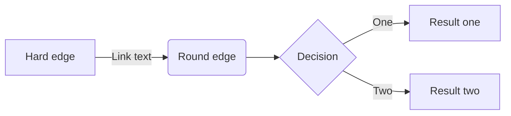
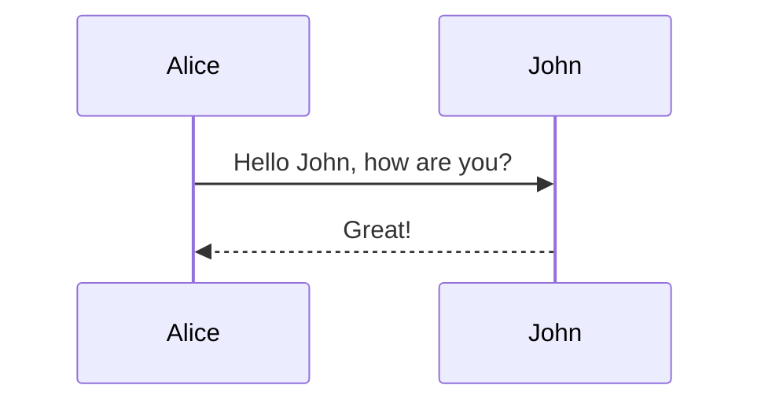

# 如何定制 Project Admin Role

### 获取 policy 

```
oslopolicy-policy-generator --namespace nova | \
     python -c 'import sys, yaml, json; json.dump(yaml.load(sys.stdin), sys.stdout, indent=4)' \
     > temp.json
```





参考
[](https://ask.openstack.org/en/question/2032/create-admin-user-within-single-tenant/)

### ChangeLog
* 20180814 

