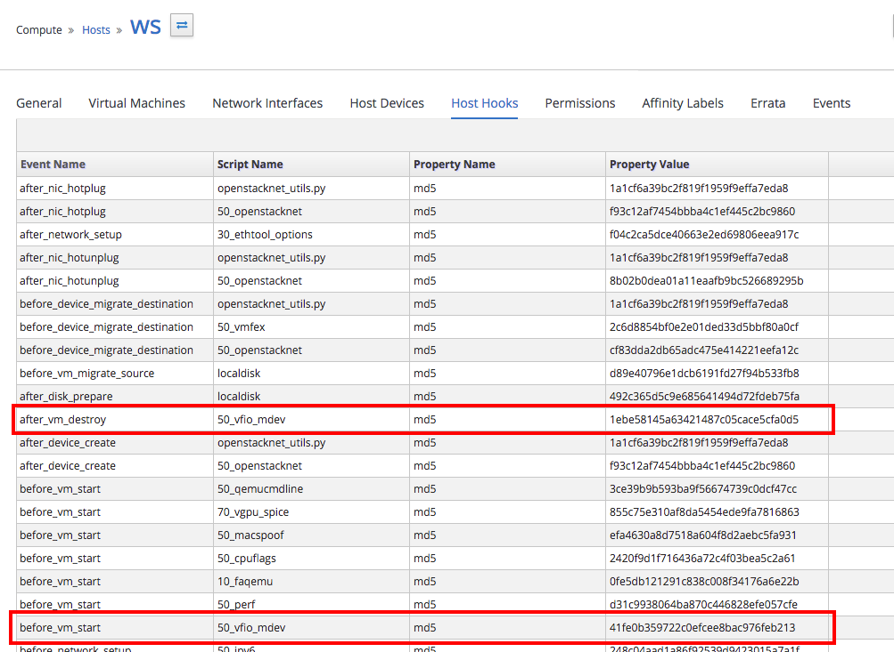
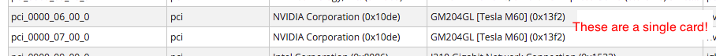
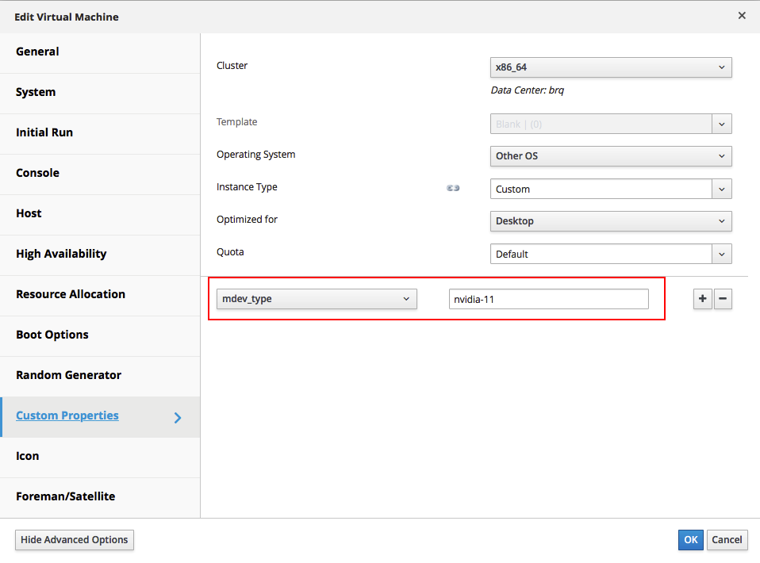
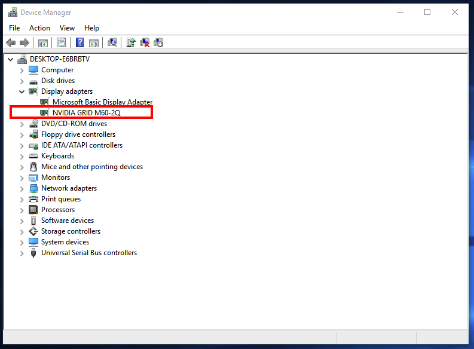

# vGPU
------
### Introduction
In oVirt 4.1.4, we added a new feature called vGPU passthrough. vGPU is a technology that allows us to “shard” a physical GPU (GRID capable, like NVIDIA Tesla M60) into number of smaller instances. Each instance can then be assigned to a VM, giving us the ability to run GPU-accelerated workloads. There is quite a bit of setup required to get the vGPU instance into the VM, and this is where oVirt comes to picture: it requires one time (per hypervisor and per VM) setup, but after that the vGPU creation and deletion is happening seamlessly. This post serves as a step-by-step guide to getting the vGPU feature up and running.

### Host Requirements
Update: IOMMU is not needed, vGPU should work even if “Device Passthrough” in the screenshot below is disabled.


Special requirement is the software - vGPU capable drivers must be installed on each host to be used for vGPU. Search for these at the [NVIDIA site](http://www.nvidia.com/Download/index.aspx), download and install it according to instructions.

Additionally, each vGPU host needs a hook called vdsm-hook-vfio-mdev. The hook is available in oVirt repositories, making the installation as easy as typing

```
yum -y install vdsm-hook-vfio-mdev
```
It should then be visible in oVirt engine, under Hosts -> Host Hooks section.


### Guest Requirements
#### OS Choice
The drivers available for guest OS must support vGPU. Consult the documentation of the guest operating system and/or NVIDIA driver to see whether vGPU drivers are available and support the chosen OS.
#### Installation
Install the guest OS without the vGPU being present. Spice or VNC should work without flaws to get us through the installation.
#### Adding vGPU and installing drivers
After the guest OS is installed, shut down the VM. We can now add the vGPU instance, but keep in mind that it will not be fully functional until the corresponding guest OS vGPU driver is installed. The process for adding a vGPU instance is as follows:
First, we have to figure out a vGPU instance type to use. That information is provided by NVIDIA datasheets, or we could SSH to one of the hypervisors where the guest is expected to run and list available vGPU instances:
```
vdsm-client -s 0 hostdevListByCaps pci

...
"mdev": {
    "nvidia-11": {
        "available_instances": 16,
        "max_resolution": "2560x1600",
        "num_heads": "2",
        "framebuffer": "512M",
        "frl_config": "45",
        "max_instance": "16"
    },
    "nvidia-12": {
        "available_instances": 16,
        "max_resolution": "2560x1600",
        "num_heads": "2",
        "framebuffer": "512M",
        "frl_config": "60",
        "max_instance": "16"
    },
    "nvidia-13": {
...
```

The mdev keys (nvidia-11, nvidia-12, …) are so called mdev instance types. We need to note the name of the desired type. Its attributes indicate how many of these instances can be present at once, and the type’s properties. Please note that right now, each reported GPU (warning: Tesla M60 contains 2 GPUs, verify how many actual GPUs are present via lspci or Host Devices within oVirt engine) may only spawn homogeneous (aka same) instances.



Then we enter the value as custom property for the desired VM:



As vGPU does not have a graphical output, Spice/VNC should still be used as a primary way to interact with the OS (with GUI). It is also possible to use serial console (oVirt has one built-in) or any other means of remote access. After system boots up, install the corresponding vGPU driver by following the instructions of NVIDIA’s installer. Reboot the guest after driver installation and verify that the vGPU is recognized:



### Summary
And that’s it! Following these steps, we have a VM that has a vGPU. To verify the functionality, it may be a good idea to run software capable of taking advantage of the vGPU and see whether the performance meets the requirements.

