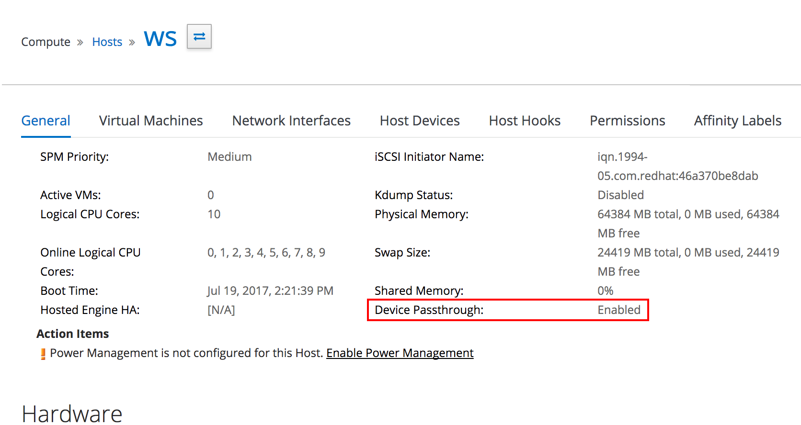

# vGPU
------
### Introduction
In oVirt 4.1.4, we added a new feature called vGPU passthrough. vGPU is a technology that allows us to “shard” a physical GPU (GRID capable, like NVIDIA Tesla M60) into number of smaller instances. Each instance can then be assigned to a VM, giving us the ability to run GPU-accelerated workloads. There is quite a bit of setup required to get the vGPU instance into the VM, and this is where oVirt comes to picture: it requires one time (per hypervisor and per VM) setup, but after that the vGPU creation and deletion is happening seamlessly. This post serves as a step-by-step guide to getting the vGPU feature up and running.

### Host Requirements
Update: IOMMU is not needed, vGPU should work even if “Device Passthrough” in the screenshot below is disabled.


Special requirement is the software - vGPU capable drivers must be installed on each host to be used for vGPU. Search for these at the [NVIDIA site](http://www.nvidia.com/Download/index.aspx), download and install it according to instructions.

Additionally, each vGPU host needs a hook called vdsm-hook-vfio-mdev. The hook is available in oVirt repositories, making the installation as easy as typing

```
yum -y install vdsm-hook-vfio-mdev
```

### Guest Requirements
#### OS Choice
#### Installation
#### Adding vGPU and installing drivers

### Summary
