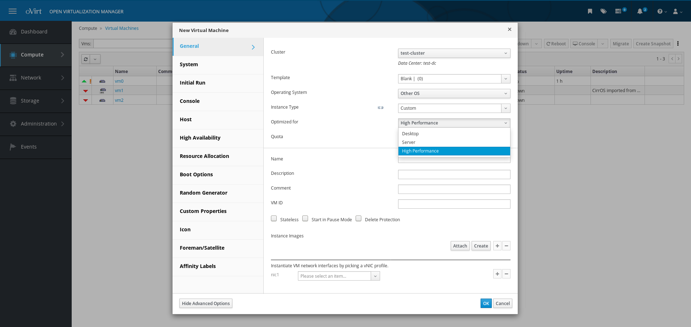

#High Performance VM
------
### 高性能虚拟机

High Performance Virtual Machine (VM) – The RHV 4.2 beta release provides a new virtual machine type called High Performance when configuring VMs. It is capable of running a VM with the highest possible performance; as close to bare metal as possible. This greatly streamlines the process of configuring the characteristics of a virtual machine over the previous manual only methods.

Some of the magic includes:
  * Enable Pass-Through Host CPU
  * Enable IO Threads, Num Of IO Threads = 1
  * Set the IO and Emulator threads pinning topology

